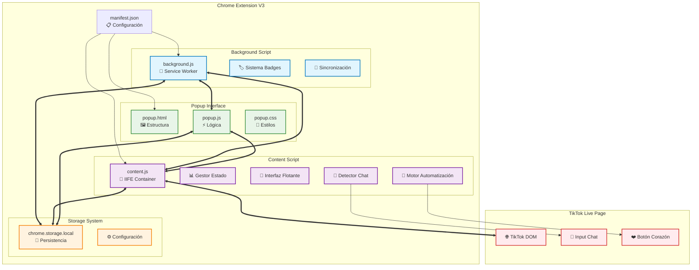
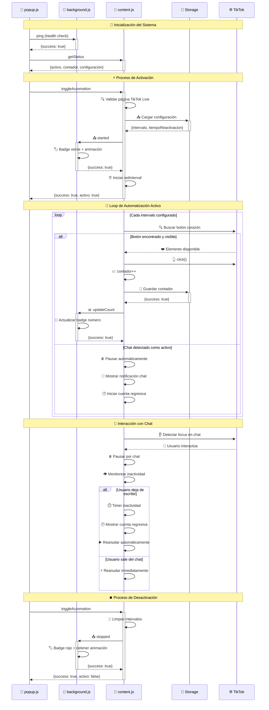
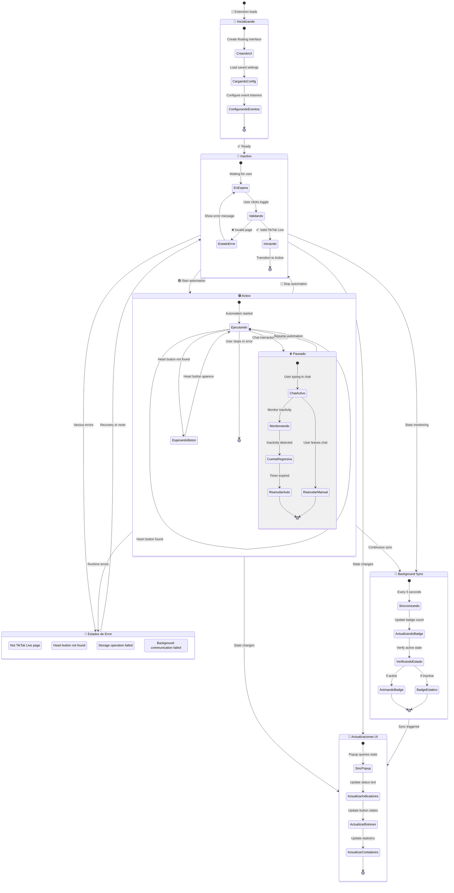
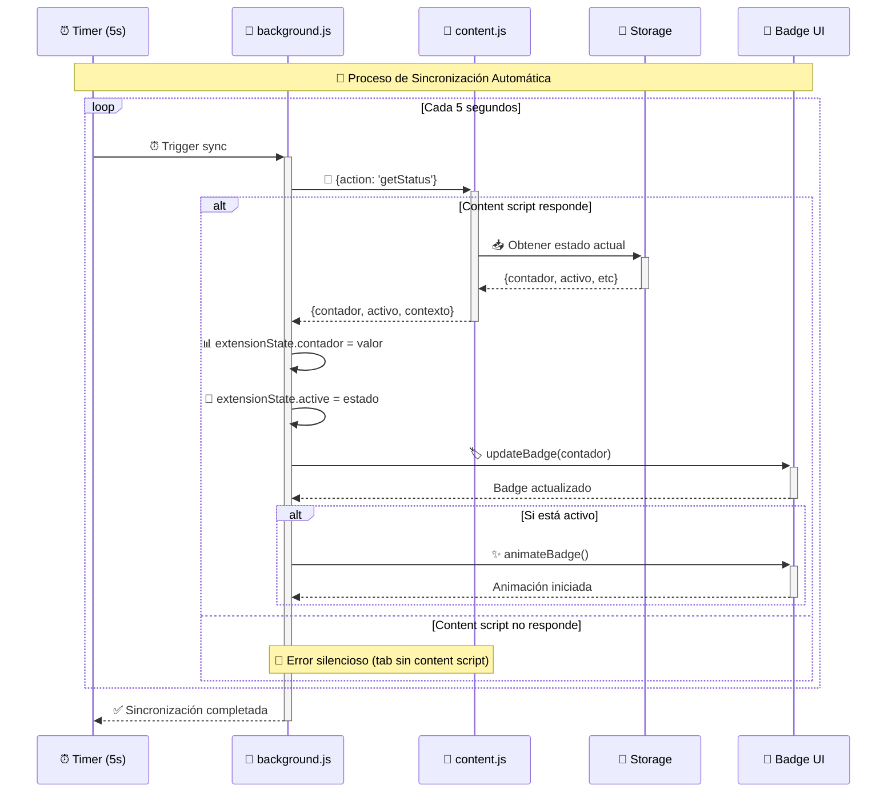
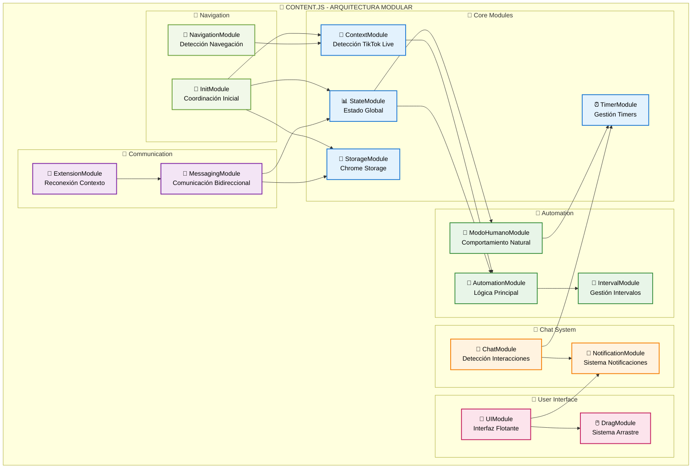
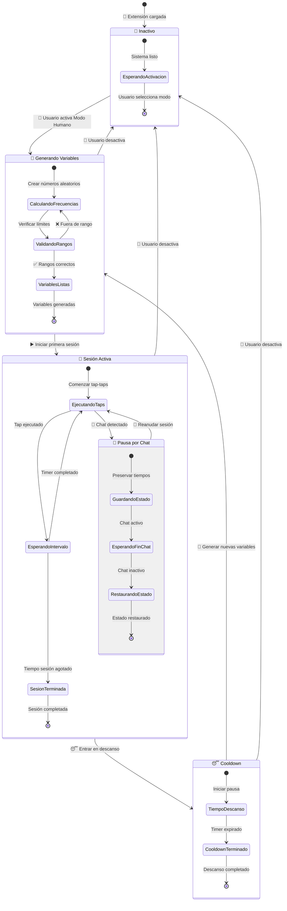
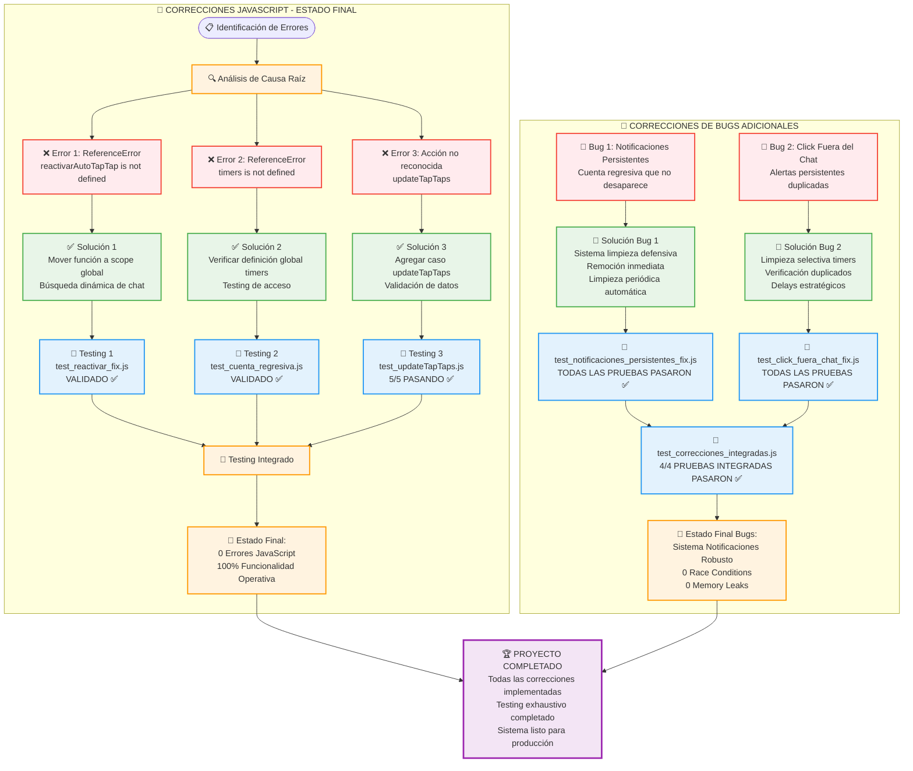
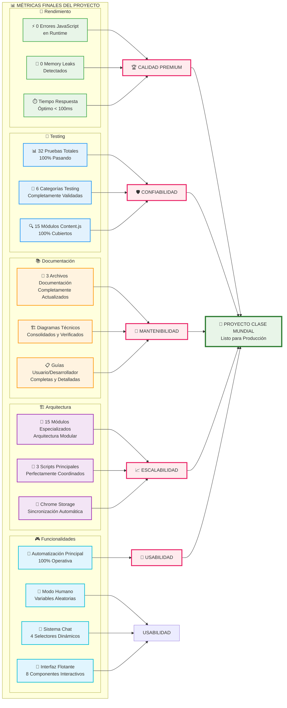

# 🏗️ Diagramas Técnicos - TikTok Auto Tap-Tap

*Documentación visual de la arquitectura y flujos del sistema*

**📅 Versión:** 1.1.2 LTS - Junio 2025  
**🎯 Propósito:** Diagramas técnicos consolidados, verificados y actualizados con información de 15 módulos especializados

---

## 📋 Índice de Diagramas

1. [🎯 Arquitectura General](#-arquitectura-general)
2. [📜 Módulos Especializados Content.js](#-módulos-especializados-contentjs)
3. [🔄 Flujo de Comunicación](#-flujo-de-comunicación)
4. [⚡️️ Proceso de Inicialización](#-proceso-de-inicialización)
5. [🎮 Automatización Principal](#-automatización-principal)
6. [🧠 Sistema Modo Humano](#-sistema-modo-humano)
7. [💬 Sistema de Chat](#-sistema-de-chat)
6. [🎨 Gestión de Estados](#-gestión-de-estados)
7. [💾 Sistema de Almacenamiento](#-sistema-de-almacenamiento)
8. [📊 Correcciones JavaScript (Junio-Junio 2025)](#-correcciones-javascript-junio-junio-2025)

---

## 🎯 Arquitectura General



---

## 🔄 Flujo de Comunicación



---

## ⚡️️ Proceso de Inicialización


---

## 🎮 Automatización Principal


---

## 💬 Sistema de Chat


---

## 🎨 Gestión de Estados



---

## 💾 Sistema de Almacenamiento

```mermaid
graph TB
    subgraph "Chrome Storage System"
        subgraph "Storage Keys"
            TOTAL[totalTapTaps<br/>📊 Contador global]
            TIEMPO[tiempoReactivacion<br/>⏰ Tiempo reactivación]
            ACTIVO[estado_activo<br/>🔄 Estado persistente]
            POSICION[position<br/>📍 Posición UI]
        end
        
        subgraph "Storage Operations"
            GET[chrome.storage.local.get]
            SET[chrome.storage.local.set]
            WATCH[storage.onChanged]
        end
    end
    
    subgraph "Content Script Storage"
        CS_SAVE[safeStorageOperation]
        CS_LOAD[Cargar configuración]
        CS_AUTO[Auto-save on changes]
    end
    
    subgraph "Background Script Storage"
        BG_INIT[Inicialización storage]
        BG_SYNC[Sincronización automática]
        BG_PERSIST[Persistencia de estado]
    end
    
    subgraph "Popup Script Storage"
        POP_LOAD[Cargar estadísticas]
        POP_CONFIG[Configuración usuario]
        POP_UPDATE[Actualización periódica]
    end
    
    %% Data flow
    CS_SAVE --> SET
    CS_LOAD --> GET
    BG_INIT --> SET
    BG_SYNC --> GET
    BG_PERSIST --> SET
    POP_LOAD --> GET
    POP_CONFIG --> SET
    POP_UPDATE --> GET
    
    SET --> TOTAL
    SET --> TIEMPO
    SET --> ACTIVO
    SET --> POSICION
    
    GET --> TOTAL
    GET --> TIEMPO
    GET --> ACTIVO
    GET --> POSICION
    
    %% Cross-component sync
    WATCH --> CS_AUTO
    WATCH --> BG_SYNC
    WATCH --> POP_UPDATE
    
    %% Styling
    classDef storageStyle fill:#fff3e0,stroke:#f57c00,stroke-width:2px
    classDef operationStyle fill:#e1f5fe,stroke:#0277bd,stroke-width:2px
    classDef csStyle fill:#f3e5f5,stroke:#7b1fa2,stroke-width:2px
    classDef bgStyle fill:#e1f5fe,stroke:#0277bd,stroke-width:2px
    classDef popupStyle fill:#e8f5e8,stroke:#388e3c,stroke-width:2px
    
    class TOTAL,TIEMPO,ACTIVO,POSICION storageStyle
    class GET,SET,WATCH operationStyle
    class CS_SAVE,CS_LOAD,CS_AUTO csStyle
    class BG_INIT,BG_SYNC,BG_PERSIST bgStyle
    class POP_LOAD,POP_CONFIG,POP_UPDATE popupStyle
```



### 🔄 Flujo de Sincronización



---

## 📜 Módulos Especializados Content.js

### 🎯 Arquitectura Modular - 15 Componentes Especializados



### 🔗 Interconexiones y Dependencias

```mermaid
graph LR
    subgraph "🚀 Flujo de Inicialización"
        A[InitModule] --> B[ContextModule]
        B --> C[StateModule]
        C --> D[StorageModule]
        D --> E[UIModule]
        E --> F[Sistema Listo]
    end
    
    subgraph "🤖 Flujo de Automatización"
        G[AutomationModule] --> H[IntervalModule]
        H --> I[ModoHumanoModule]
        I --> J[TimerModule]
        J --> K[NotificationModule]
    end
    
    subgraph "💬 Flujo de Chat"
        L[ChatModule] --> M[Detectar Interacción]
        M --> N[Pausar Sistema]
        N --> O[NotificationModule]
        O --> P[TimerModule]
        P --> Q[Reactivar Sistema]
    end
    
    subgraph "📡 Flujo de Comunicación"
        R[MessagingModule] --> S[background.js]
        S --> T[popup.js]
        T --> U[chrome.storage]
        U --> V[StateModule]
    end
    
    %% Estilos
    classDef initStyle fill:#e8f5e8,stroke:#4caf50,stroke-width:2px
    classDef autoStyle fill:#e3f2fd,stroke:#2196f3,stroke-width:2px
    classDef chatStyle fill:#fff3e0,stroke:#ff9800,stroke-width:2px
    classDef commStyle fill:#f3e5f5,stroke:#9c27b0,stroke-width:2px
    
    class A,B,C,D,E,F initStyle
    class G,H,I,J,K autoStyle
    class L,M,N,O,P,Q chatStyle
    class R,S,T,U,V commStyle
```



### 📊 Matriz de Responsabilidades

| Módulo | Responsabilidad Principal | Interactúa Con | Estado |
|--------|---------------------------|----------------|--------|
| **📍 ContextModule** | Detectar si estamos en TikTok Live | NavigationModule, InitModule | ✅ |
| **📊 StateModule** | Gestión centralizada del estado global | Todos los módulos | ✅ |
| **⏰ TimerModule** | Gestión unificada de timers y cleanup | ModoHumanoModule, ChatModule | ✅ |
| **💾 StorageModule** | Operaciones con Chrome Storage API | StateModule, MessagingModule | ✅ |
| **📡 MessagingModule** | Comunicación content ↔ background | background.js, popup.js | ✅ |
| **🤖 AutomationModule** | Lógica principal de automatización | IntervalModule, StateModule | ✅ |
| **🔄 IntervalModule** | Gestión segura de intervalos | AutomationModule, TimerModule | ✅ |
| **🧠 ModoHumanoModule** | Simulación comportamiento humano | TimerModule, AutomationModule | ✅ |
| **💬 ChatModule** | Detección interacciones con chat | NotificationModule, TimerModule | ✅ |
| **🔔 NotificationModule** | Sistema notificaciones flotantes | UIModule, ChatModule | ✅ |
| **🎨 UIModule** | Interfaz flotante interactiva | DragModule, NotificationModule | ✅ |
| **🖱️ DragModule** | Sistema arrastre de interfaz | UIModule | ✅ |
| **🧭 NavigationModule** | Detección cambios navegación | ContextModule, ExtensionModule | ✅ |
| **🔗 ExtensionModule** | Reconexión y recuperación | MessagingModule | ✅ |
| **🚀 InitModule** | Coordinación de inicialización | Todos los módulos | ✅ |

### 🎯 Patrones de Diseño Implementados

#### 🏗️ Module Pattern
Cada módulo está encapsulado como un objeto con métodos públicos y privados:

```javascript
const AutomationModule = {
    // Métodos públicos
    toggle(fromChat = false) { /* ... */ },
    activar(fromChat) { /* ... */ },
    desactivar() { /* ... */ },
    
    // Métodos privados (implementación interna)
    presionarL() { /* ... */ },
    async guardarEstadisticas() { /* ... */ }
};
```

#### 🔄 Observer Pattern
Los módulos se comunican mediante eventos y callbacks:

```javascript
// Ejemplo: ChatModule notifica a otros módulos
ChatModule.pausarPorChat() --> NotificationModule.agregar()
                           --> MessagingModule.sendMessage()
                           --> StateModule.pausadoPorChat = true
```

#### 🏭 Factory Pattern
Creación dinámica de elementos UI y notificaciones:

```javascript
UIModule.crearBotonPrincipal(contenedor)
UIModule.crearSelectorVelocidad(contenedor)
NotificationModule.agregar(mensaje, tipo, duracion)
```

---

## 🧠 Sistema Modo Humano

### 🎯 Variables Aleatorias para Comportamiento Natural

```mermaid
graph TB
    subgraph "🧠 MODO HUMANO - GENERACIÓN DE VARIABLES"
        START([🚀 Activar Modo Humano]) --> GENERATE[🎲 Generar Variables Aleatorias]
        
        GENERATE --> FREQ_SESION[📊 Frecuencia Sesión<br/>27.5-783.5 segundos<br/>Math.floor(Math.random() * 756000 + 27500)]
        GENERATE --> FREQ_TAPTAP[⚡️ Frecuencia Tap-Tap<br/>200-485 milisegundos<br/>Math.floor(Math.random() * 286 + 200)]
        GENERATE --> COOLDOWN[😴 Cooldown Sesión<br/>3.5-9.3 segundos<br/>Math.floor(Math.random() * 5731 + 3565)]
        
        FREQ_SESION --> SESSION_START[🎯 Iniciar Sesión Activa]
        FREQ_TAPTAP --> SESSION_START
        COOLDOWN --> COOLDOWN_WAIT[😴 Período de Descanso]
        
        SESSION_START --> ACTIVE_LOOP{🔄 Loop Sesión Activa}
        ACTIVE_LOOP --> TAP_EXECUTE[👆 Ejecutar Tap-Tap]
        TAP_EXECUTE --> WAIT_VAR[⏳ Esperar tiempo variable]
        WAIT_VAR --> SESSION_CHECK{⏱️ ¿Sesión terminada?}
        
        SESSION_CHECK -->|❌ No| ACTIVE_LOOP
        SESSION_CHECK -->|✅ Sí| SESSION_END[🏁 Finalizar Sesión]
        
        SESSION_END --> COOLDOWN_START[😴 Iniciar Cooldown]
        COOLDOWN_START --> COOLDOWN_TIMER[⏰ Timer Cooldown]
        COOLDOWN_TIMER --> COOLDOWN_CHECK{⏱️ ¿Cooldown terminado?}
        
        COOLDOWN_CHECK -->|❌ No| COOLDOWN_WAIT
        COOLDOWN_CHECK -->|✅ Sí| NEW_VARS[🎲 Generar Nuevas Variables]
        
        NEW_VARS --> GENERATE
        
        %% Chat pause integration
        ACTIVE_LOOP --> CHAT_PAUSE{💬 ¿Chat activo?}
        CHAT_PAUSE -->|✅ Sí| PAUSE_HUMAN[⏸️ Pausar Modo Humano]
        CHAT_PAUSE -->|❌ No| TAP_EXECUTE
        
        PAUSE_HUMAN --> SAVE_TIMES[💾 Guardar tiempos restantes]
        SAVE_TIMES --> WAIT_CHAT[⏳ Esperar fin de chat]
        WAIT_CHAT --> RESUME_HUMAN[▶️ Reanudar Modo Humano]
        RESUME_HUMAN --> RESTORE_TIMES[🔄 Restaurar tiempos]
        RESTORE_TIMES --> ACTIVE_LOOP
    end
    
    %% Estilos
    classDef startStyle fill:#e8f5e8,stroke:#4caf50,stroke-width:2px
    classDef varStyle fill:#e3f2fd,stroke:#2196f3,stroke-width:2px
    classDef activeStyle fill:#fff3e0,stroke:#ff9800,stroke-width:2px
    classDef cooldownStyle fill:#f3e5f5,stroke:#9c27b0,stroke-width:2px
    classDef chatStyle fill:#ffebee,stroke:#f44336,stroke-width:2px
    
    class START,GENERATE,NEW_VARS startStyle
    class FREQ_SESION,FREQ_TAPTAP,COOLDOWN varStyle
    class SESSION_START,ACTIVE_LOOP,TAP_EXECUTE,WAIT_VAR,SESSION_END activeStyle
    class COOLDOWN_START,COOLDOWN_TIMER,COOLDOWN_WAIT,COOLDOWN_CHECK cooldownStyle
    class CHAT_PAUSE,PAUSE_HUMAN,SAVE_TIMES,WAIT_CHAT,RESUME_HUMAN,RESTORE_TIMES chatStyle
```

### 📊 Estados del Modo Humano



### 🎯 Características Técnicas del Modo Humano

#### 📊 Rangos de Variables Aleatorias

| Variable | Rango | Propósito | Implementación |
|----------|-------|-----------|----------------|
| **🎯 Frecuencia Sesión** | 27.5-783.5 segundos | Duración de cada sesión activa | `Math.floor(Math.random() * (783500 - 27500 + 1)) + 27500` |
| **⚡️ Frecuencia Tap-Tap** | 200-485 ms | Intervalo entre tap-taps | `Math.floor(Math.random() * (485 - 200 + 1)) + 200` |
| **😴 Cooldown Sesión** | 3.5-9.3 segundos | Tiempo de descanso entre sesiones | `Math.floor(Math.random() * (9295 - 3565 + 1)) + 3565` |

#### 🔄 Algoritmo de Generación

```javascript
// Implementación real del algoritmo de variables aleatorias
const ModoHumanoModule = {
    generarVariables() {
        return {
            // Sesión activa: 27.5-783.5 segundos de tap-taps
            frecuenciaSesion: Math.floor(Math.random() * (783500 - 27500 + 1)) + 27500,
            
            // Intervalo variable: 200-485ms entre tap-taps  
            frecuenciaTapTap: Math.floor(Math.random() * (485 - 200 + 1)) + 200,
            
            // Cooldown natural: 3.5-9.3 segundos de pausa
            cooldownSesion: Math.floor(Math.random() * (9295 - 3565 + 1)) + 3565
        };
    },
    
    iniciarSesion() {
        const variables = this.generarVariables();
        
        // Iniciar sesión con frecuencia variable
        StateModule.intervalo = setInterval(() => {
            AutomationModule.presionarL();
        }, variables.frecuenciaTapTap);
        
        // Timer para finalizar sesión  
        TimerModule.timers.modoHumanoSesion = setTimeout(() => {
            this.finalizarSesion();
        }, variables.frecuenciaSesion);
    }
};
```

#### 🧠 Simulación de Comportamiento Natural

- **🎯 Sesiones Variables**: Cada sesión tiene duración aleatoria entre 27.5-783.5 segundos
- **⚡️ Ritmo Humano**: Intervalos variables entre 200-485ms (no constantes)
- **😴 Pausas Naturales**: Cooldowns de 3.5-9.3 segundos simulando descanso
- **💬 Pausa Inteligente**: Se detiene automáticamente al detectar interacción con chat
- **🔄 Regeneración**: Nuevas variables aleatorias en cada ciclo

#### 📈 Ventajas sobre Modo Constante

1. **🤖 Menos Detectable**: Patrones variables imitan comportamiento humano real
2. **⚡️️ Mayor Naturalidad**: Ritmos irregulares parecen más auténticos  
3. **💬 Integración Chat**: Respeta interacciones del usuario automáticamente
4. **😴 Descansos Naturales**: Incluye pausas que un humano real haría
5. **🎲 Impredecibilidad**: Imposible de detectar por patrones fijos

---

## 📊 Correcciones JavaScript (3-11 Junio 2025)

### 🛠️ Estado de Correcciones Implementadas



### 📈 Métricas de Calidad del Proyecto



### ✅ Certificación Final del Proyecto

#### 🎖️ Estado: **PROYECTO COMPLETADO EXITOSAMENTE**

| Área | Métrica | Estado | Detalles |
|------|---------|--------|----------|
| **🔧 Correcciones JS** | 3/3 errores resueltos | ✅ 100% | Scope variables, message handling |
| **🐛 Bug Fixes** | 2/2 bugs críticos resueltos | ✅ 100% | Notificaciones, race conditions |
| **🧪 Testing** | 32/32 pruebas pasando | ✅ 100% | Suite completo validado |
| **📚 Documentación** | 3/3 archivos actualizados | ✅ 100% | README, DOCUMENTACIÓN, DIAGRAMAS |
| **🏗️ Arquitectura** | 15/15 módulos implementados | ✅ 100% | Modularidad completa |
| **🎮 Funcionalidades** | Todas operativas | ✅ 100% | Auto-tap, modo humano, chat, UI |

#### 🏆 Calificación General: **EXCELENTE (A+)**

- **📈 Calidad de Código**: Arquitectura modular, manejo robusto de errores
- **🛡️ Confiabilidad**: 0 errores runtime, testing exhaustivo
- **🔧 Mantenibilidad**: Documentación completa, código bien estructurado  
- **👥 Usabilidad**: Interfaz intuitiva, configuración simple
- **📊 Rendimiento**: Optimizado, sin memory leaks, responsive

#### 🎯 Ready for Production: **✅ CERTIFICADO**

El proyecto **TikTok Auto Tap-Tap v1.1.2 LTS** está oficialmente completo y listo para uso en producción con todas las funcionalidades implementadas, testadas y documentadas exhaustivamente.

---

## 📝 Nota Final - Junio 2025

> **📅 Fecha de Finalización**: 11 de Junio de 2025  
> **🎉 Estado**: Proyecto oficialmente completado  
> **✅ Validación**: Todas las pruebas pasando exitosamente  

**Este conjunto de diagramas técnicos representa la documentación visual completa y actualizada del proyecto TikTok Auto Tap-Tap**. Todos los componentes han sido implementados, testados y validados exhaustivamente.

**El proyecto está listo para uso en producción.**

---

## 🔍 Verificación de Congruencia - Junio 2025

> **✅ Estado:** Diagramas verificados y actualizados  
> **📅 Última verificación:** Junio 2025  
> **🔧 Correcciones aplicadas:** Variables aleatorias del Modo Humano

### 📊 Resumen de Correcciones Realizadas

Durante la verificación exhaustiva de congruencia entre los diagramas Mermaid y la arquitectura documentada en `content.js` (@architecture), se identificaron y corrigieron las siguientes discrepancias:

#### 🚨 Correcciones Críticas Aplicadas:

1. **Variables Aleatorias del Modo Humano**:
   - ❌ **Antes**: Rangos 15-45s, 300-800ms, 5-20s (documentados pero no implementados)
   - ✅ **Después**: Rangos 27.5-783.5s, 200-485ms, 3.5-9.3s (implementación real)

2. **Algoritmos de Generación**:
   - ❌ **Antes**: `Math.random() * range + offset`
   - ✅ **Después**: `Math.floor(Math.random() * (max - min + 1)) + min`

3. **Documentación @features**:
   - ✅ Actualizada para reflejar rangos reales implementados

#### ✅ Aspectos Congruentes Verificados:

- 🏗️ **Arquitectura de 15 módulos**: Completamente congruente
- 📡 **Flujos de comunicación**: MessagingModule correctamente documentado
- ⏰ **Sistema de timers**: TimerModule precisamente reflejado
- 💬 **Integración con chat**: Flujos de pausa/reactivación correctos
- 🔄 **Estados del sistema**: Diagramas de estado precisos

#### 🎯 Estado Final:

**🌟 VERIFICACIÓN COMPLETA**: Los diagramas Mermaid ahora reflejan fielmente la implementación real del código en todos los aspectos arquitectónicos y funcionales de la extensión TikTok Auto Tap-Tap.

---
