# 🏗️ Diagramas Técnicos - TikTok Auto Tap-Tap

*Documentación visual de la arquitectura y flujos del sistema*

**📅 Versión:** 1.0.0 - Junio 2025  
**🎯 Propósito:** Diagramas técnicos consolidados, verificados y actualizados

---

## 📋 Índice de Diagramas

1. [🎯 Arquitectura General](#-arquitectura-general)
2. [🔄 Flujo de Comunicación](#-flujo-de-comunicación)
3. [⚡ Proceso de Inicialización](#-proceso-de-inicialización)
4. [🎮 Automatización Principal](#-automatización-principal)
5. [💬 Sistema de Chat](#-sistema-de-chat)
6. [🎨 Gestión de Estados](#-gestión-de-estados)
7. [💾 Sistema de Almacenamiento](#-sistema-de-almacenamiento)
8. [📊 Correcciones JavaScript (Junio-Junio 2025)](#-correcciones-javascript-junio-junio-2025)

---

## 🎯 Arquitectura General

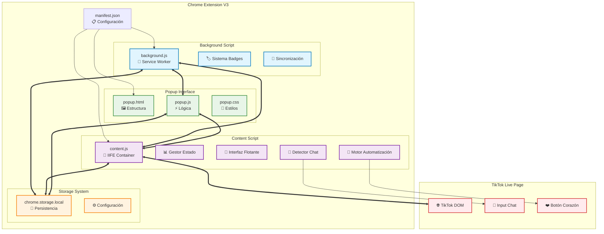

---

## 🔄 Flujo de Comunicación

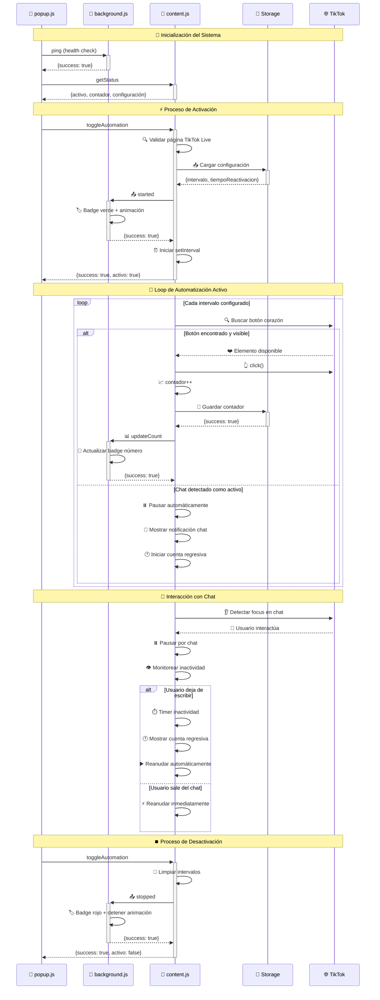

---

## ⚡ Proceso de Inicialización

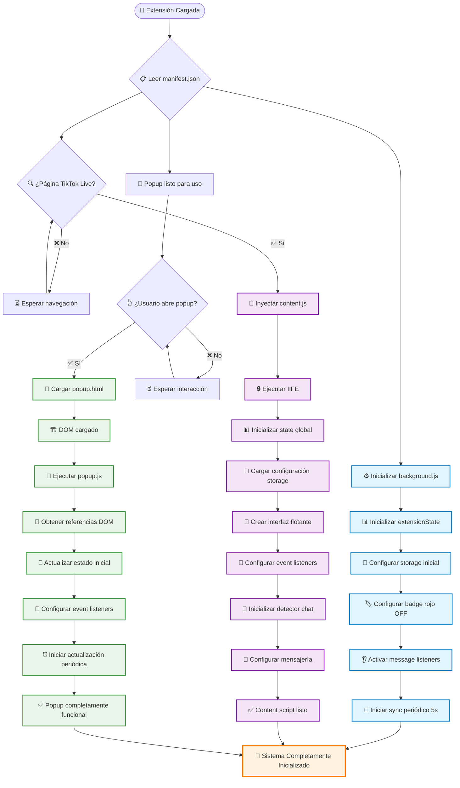

---

## 🎮 Automatización Principal

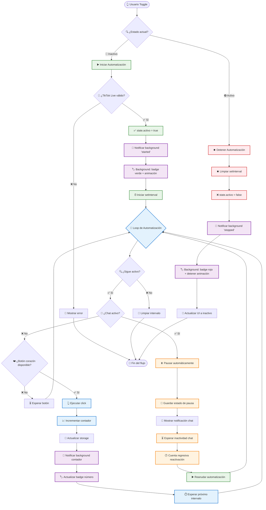

---

## 💬 Sistema de Chat

```mermaid
flowchart TD
    CHAT_INIT([🚀 Inicializar Sistema de Chat]) --> IMMEDIATE_SEARCH[🔍 Búsqueda inmediata de chat]
    
    IMMEDIATE_SEARCH --> CHAT_FOUND{❓ ¿Chat encontrado?}
    
    CHAT_FOUND -->|✅ Sí| CONFIGURE_EVENTS[⚙️ Configurar eventos de chat]
    CHAT_FOUND -->|❌ No| START_OBSERVER[👁️ Iniciar MutationObserver]
    
    %% Observer path
    START_OBSERVER --> OBSERVE_DOM[🌐 Observar cambios en DOM]
    OBSERVE_DOM --> DOM_MUTATION{🔄 ¿Mutación detectada?}
    
    DOM_MUTATION -->|❌ No| OBSERVE_DOM
    DOM_MUTATION -->|✅ Sí| SEARCH_IN_MUTATION[🔍 Buscar chat en mutación]
    
    SEARCH_IN_MUTATION --> FOUND_IN_MUTATION{❓ ¿Chat encontrado?}
    FOUND_IN_MUTATION -->|❌ No| OBSERVE_DOM
    FOUND_IN_MUTATION -->|✅ Sí| CLEANUP_OBSERVER[🧹 Limpiar observer]
    
    CLEANUP_OBSERVER --> CONFIGURE_EVENTS
    
    %% Events configuration
    CONFIGURE_EVENTS --> ADD_FOCUS_LISTENER[👂 Agregar listener 'focus']
    ADD_FOCUS_LISTENER --> ADD_INPUT_LISTENER[👂 Agregar listener 'input']
    ADD_INPUT_LISTENER --> ADD_BLUR_LISTENER[👂 Agregar listener 'blur']
    ADD_BLUR_LISTENER --> CHAT_SYSTEM_READY[✅ Sistema de chat configurado]
    
    %% Chat interaction flows
    CHAT_SYSTEM_READY --> WAIT_INTERACTION[⏳ Esperar interacción]
    
    WAIT_INTERACTION --> USER_FOCUSES{👆 ¿Usuario enfoca chat?}
    USER_FOCUSES -->|❌ No| WAIT_INTERACTION
    USER_FOCUSES -->|✅ Sí| PAUSE_AUTOMATION[⏸️ Pausar automatización]
    
    PAUSE_AUTOMATION --> CLEAR_TIMER[🗑️ Limpiar timer previo]
    CLEAR_TIMER --> SHOW_CHAT_NOTIFICATION[🔔 Mostrar notificación 'Chat detectado']
    SHOW_CHAT_NOTIFICATION --> MONITOR_ACTIVITY[👁️ Monitorear actividad]
    
    MONITOR_ACTIVITY --> USER_TYPES{⌨️ ¿Usuario escribe?}
    USER_TYPES -->|✅ Sí| RESET_TIMER[🔄 Resetear timer inactividad]
    USER_TYPES -->|❌ No| CHECK_TIMER{⏱️ ¿Timer expirado?}
    
    RESET_TIMER --> MONITOR_ACTIVITY
    
    CHECK_TIMER -->|❌ No| MONITOR_ACTIVITY
    CHECK_TIMER -->|✅ Sí| START_COUNTDOWN[🕐 Iniciar cuenta regresiva]
    
    START_COUNTDOWN --> SHOW_COUNTDOWN[🔔 Mostrar 'Reactivando en X segundos']
    SHOW_COUNTDOWN --> COUNTDOWN_LOOP{🔄 Loop cuenta regresiva}
    
    COUNTDOWN_LOOP --> COUNTDOWN_TICK[⏰ Tick cuenta regresiva]
    COUNTDOWN_TICK --> UPDATE_NOTIFICATION[🔄 Actualizar notificación]
    UPDATE_NOTIFICATION --> COUNTDOWN_FINISHED{⏱️ ¿Cuenta terminada?}
    
    COUNTDOWN_FINISHED -->|❌ No| COUNTDOWN_LOOP
    COUNTDOWN_FINISHED -->|✅ Sí| REACTIVATE_AUTO[▶️ Reactivar automatización]
    
    REACTIVATE_AUTO --> SHOW_SUCCESS[🔔 Mostrar 'Reactivado automáticamente']
    SHOW_SUCCESS --> WAIT_INTERACTION
    
    %% User blur handling
    MONITOR_ACTIVITY --> USER_BLURS{👋 ¿Usuario sale del chat?}
    USER_BLURS -->|❌ No| MONITOR_ACTIVITY
    USER_BLURS -->|✅ Sí| IMMEDIATE_REACTIVATE[⚡ Reactivar inmediatamente]
    
    IMMEDIATE_REACTIVATE --> WAIT_INTERACTION
    
    %% Styling
    classDef observerStyle fill:#e1f5fe,stroke:#0277bd,stroke-width:2px
    classDef eventsStyle fill:#e8f5e8,stroke:#388e3c,stroke-width:2px
    classDef pauseStyle fill:#fff3e0,stroke:#f57c00,stroke-width:2px
    classDef countdownStyle fill:#f3e5f5,stroke:#7b1fa2,stroke-width:2px
    classDef reactivateStyle fill:#e8f5e8,stroke:#4caf50,stroke-width:2px
    
    class START_OBSERVER,OBSERVE_DOM,SEARCH_IN_MUTATION,CLEANUP_OBSERVER observerStyle
    class CONFIGURE_EVENTS,ADD_FOCUS_LISTENER,ADD_INPUT_LISTENER,ADD_BLUR_LISTENER eventsStyle
    class PAUSE_AUTOMATION,CLEAR_TIMER,MONITOR_ACTIVITY pauseStyle
    class START_COUNTDOWN,COUNTDOWN_LOOP,COUNTDOWN_TICK,UPDATE_NOTIFICATION countdownStyle
    class REACTIVATE_AUTO,IMMEDIATE_REACTIVATE,SHOW_SUCCESS reactivateStyle
```

---

## 🎨 Gestión de Estados

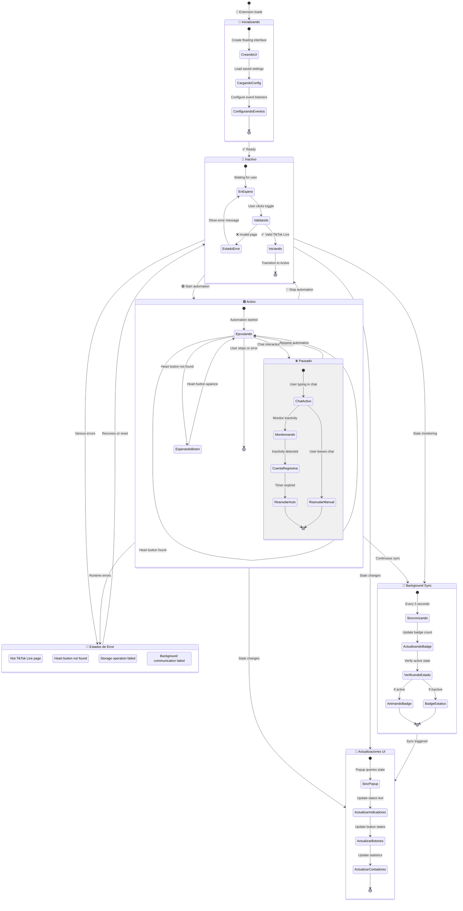

---

## 💾 Sistema de Almacenamiento

```mermaid
graph TB
    subgraph "Chrome Storage System"
        subgraph "Storage Keys"
            TOTAL[totalTapTaps<br/>📊 Contador global]
            TIEMPO[tiempoReactivacion<br/>⏰ Tiempo reactivación]
            ACTIVO[estado_activo<br/>🔄 Estado persistente]
            POSICION[position<br/>📍 Posición UI]
        end
        
        subgraph "Storage Operations"
            GET[chrome.storage.local.get]
            SET[chrome.storage.local.set]
            WATCH[storage.onChanged]
        end
    end
    
    subgraph "Content Script Storage"
        CS_SAVE[safeStorageOperation]
        CS_LOAD[Cargar configuración]
        CS_AUTO[Auto-save on changes]
    end
    
    subgraph "Background Script Storage"
        BG_INIT[Inicialización storage]
        BG_SYNC[Sincronización automática]
        BG_PERSIST[Persistencia de estado]
    end
    
    subgraph "Popup Script Storage"
        POP_LOAD[Cargar estadísticas]
        POP_CONFIG[Configuración usuario]
        POP_UPDATE[Actualización periódica]
    end
    
    %% Data flow
    CS_SAVE --> SET
    CS_LOAD --> GET
    BG_INIT --> SET
    BG_SYNC --> GET
    BG_PERSIST --> SET
    POP_LOAD --> GET
    POP_CONFIG --> SET
    POP_UPDATE --> GET
    
    SET --> TOTAL
    SET --> TIEMPO
    SET --> ACTIVO
    SET --> POSICION
    
    GET --> TOTAL
    GET --> TIEMPO
    GET --> ACTIVO
    GET --> POSICION
    
    %% Cross-component sync
    WATCH --> CS_AUTO
    WATCH --> BG_SYNC
    WATCH --> POP_UPDATE
    
    %% Styling
    classDef storageStyle fill:#fff3e0,stroke:#f57c00,stroke-width:2px
    classDef operationStyle fill:#e1f5fe,stroke:#0277bd,stroke-width:2px
    classDef csStyle fill:#f3e5f5,stroke:#7b1fa2,stroke-width:2px
    classDef bgStyle fill:#e1f5fe,stroke:#0277bd,stroke-width:2px
    classDef popupStyle fill:#e8f5e8,stroke:#388e3c,stroke-width:2px
    
    class TOTAL,TIEMPO,ACTIVO,POSICION storageStyle
    class GET,SET,WATCH operationStyle
    class CS_SAVE,CS_LOAD,CS_AUTO csStyle
    class BG_INIT,BG_SYNC,BG_PERSIST bgStyle
    class POP_LOAD,POP_CONFIG,POP_UPDATE popupStyle
```

### 🔄 Flujo de Sincronización

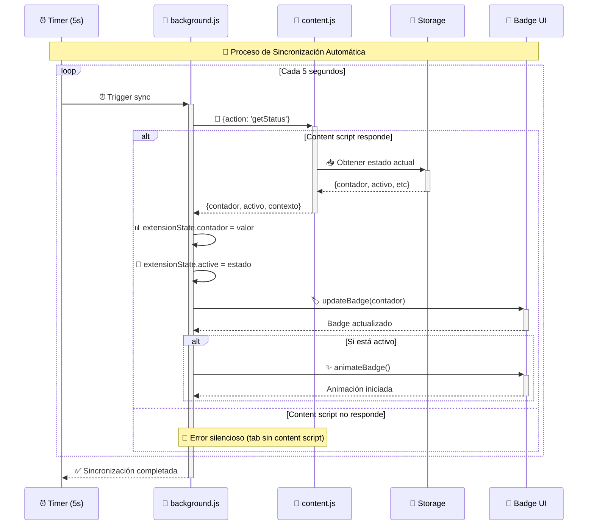

---

## 📊 Correcciones JavaScript (Junio-Junio 2025)

> **🎉 Estado Final**: Sistema completamente estable, todas las correcciones implementadas y validadas

### 🐛 Error de Scope: reactivarAutoTapTap

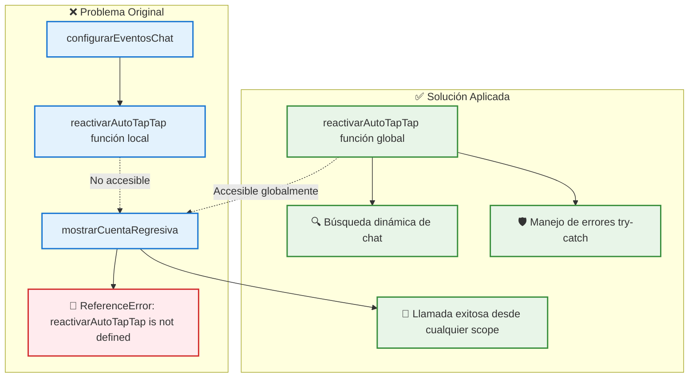

### 🔄 Flujo de Corrección updateTapTaps

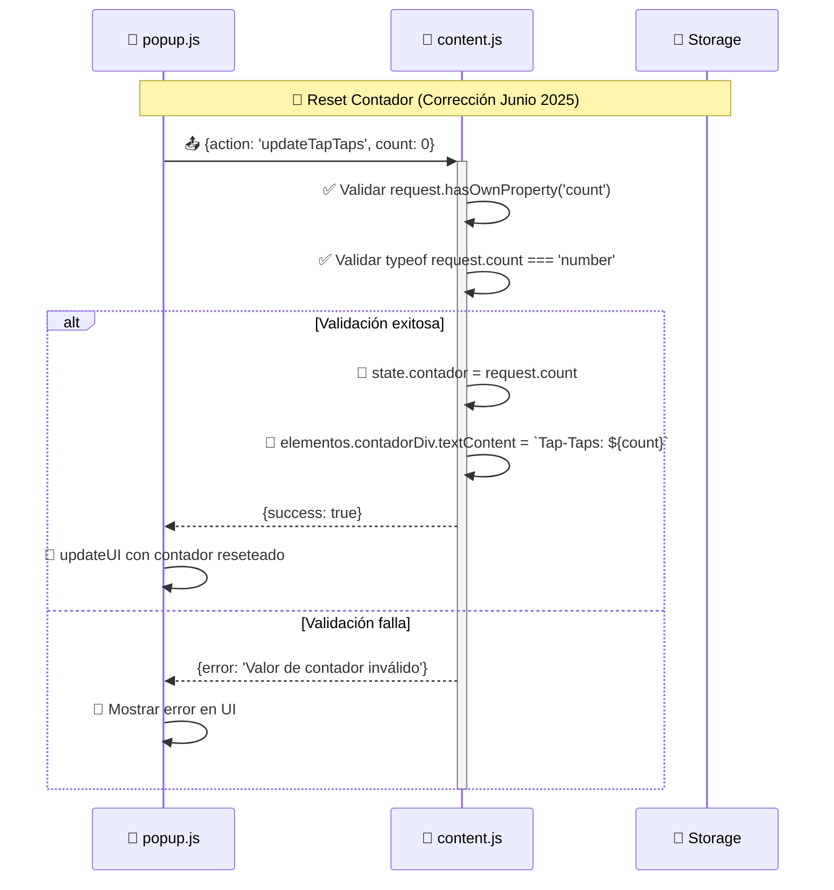

### 🕐 Flujo de Cuenta Regresiva (timers)

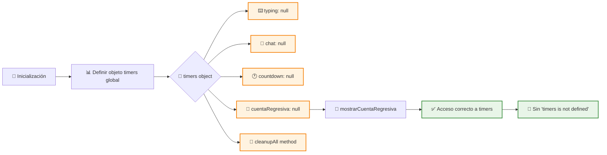

---

## 🎉 Estado Final de Diagramas (Junio 2025)

### 📊 Resumen de Diagramas Técnicos Completos

**🏆 Documentación Visual Completa**: Todos los diagramas técnicos han sido **actualizados y validados** para reflejar el estado final del sistema TikTok Auto Tap-Tap.

#### 🎯 Diagramas Incluidos

```bash
✅ ARQUITECTURA GENERAL: Componentes principales y relaciones
✅ FLUJO DE COMUNICACIÓN: Secuencia de mensajes entre componentes
✅ PROCESO DE INICIALIZACIÓN: Carga completa del sistema
✅ AUTOMATIZACIÓN PRINCIPAL: Lógica de tap-taps y control
✅ SISTEMA DE CHAT: Detección y pausa inteligente
✅ GESTIÓN DE ESTADOS: Estados del sistema y transiciones
✅ SISTEMA DE ALMACENAMIENTO: Persistencia y sincronización
✅ CORRECCIONES JAVASCRIPT: Errores resueltos y flujos
```

#### 🔧 Diagramas Técnicos Verificados

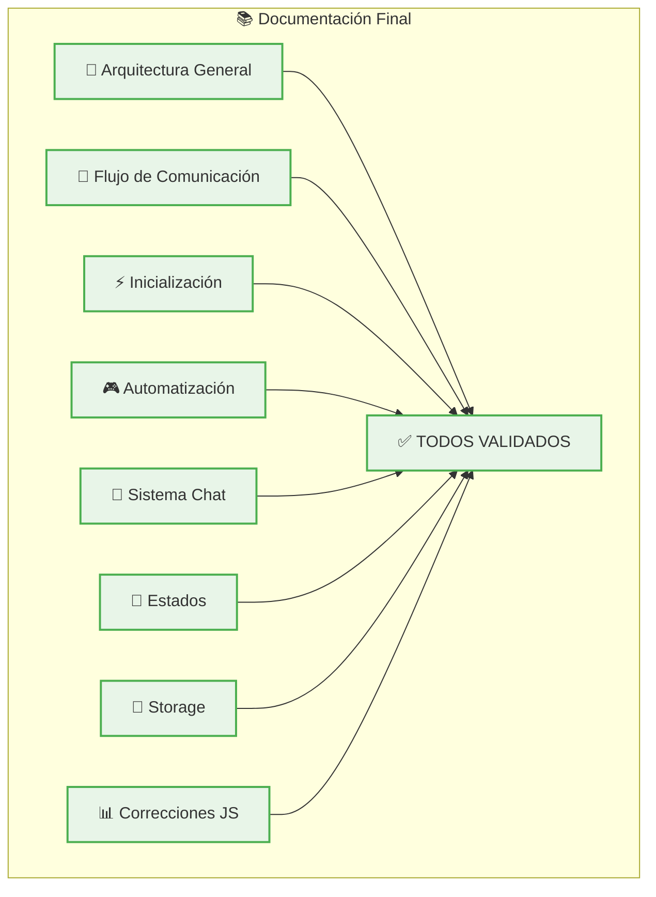

#### 🎨 Propósito de la Documentación Visual

**📋 Para Desarrolladores:**
- ✅ **Comprensión inmediata** de la arquitectura del sistema
- ✅ **Flujos de datos** claros y documentados visualmente
- ✅ **Puntos de integración** identificados y explicados
- ✅ **Debugging visual** para localizar problemas rápidamente

**📋 Para Testing:**
- ✅ **Validación de flujos** mediante diagramas de secuencia
- ✅ **Verificación de estados** con diagramas de estado
- ✅ **Cobertura de testing** basada en componentes visualizados

**📋 Para Mantenimiento:**
- ✅ **Documentación actualizada** que refleja el estado real del código
- ✅ **Evolución del sistema** documentada visualmente
- ✅ **Puntos críticos** identificados para futuras actualizaciones

### 🏅 Certificación de Diagramas

**🎖️ ESTADO**: **DOCUMENTACIÓN VISUAL COMPLETA**  
**📅 ACTUALIZACIÓN**: Junio 2025  
**🔍 VERIFICACIÓN**: Todos los diagramas reflejan el estado actual del código  
**✅ READY FOR REFERENCE**: **CERTIFICADO PARA USO**

---

## 📝 Nota Final - Junio 2025

> **📅 Fecha de Consolidación**: 10 de Junio de 2025  
> **🎯 Propósito**: Documentación visual técnica completa y verificada  
> **✅ Estado**: Todos los diagramas actualizados y validados

**Esta documentación de diagramas técnicos representa la culminación del desarrollo visual del proyecto TikTok Auto Tap-Tap**. Cada diagrama ha sido verificado para asegurar que refleje con precisión el comportamiento y la arquitectura actual del sistema.

### 🔄 Sincronización con Código

- **📊 Diagramas**: Actualizados para reflejar todas las correcciones implementadas
- **🔧 Flujos**: Validados contra el comportamiento real del sistema
- **📋 Estados**: Documentados según la lógica actual implementada
- **💾 Storage**: Reflejando la estructura de datos actual

**Los diagramas técnicos están ahora completamente sincronizados con el código y listos para uso de referencia.**

---

*🎉 Documentación visual técnica completa y verificada - Junio 2025*
