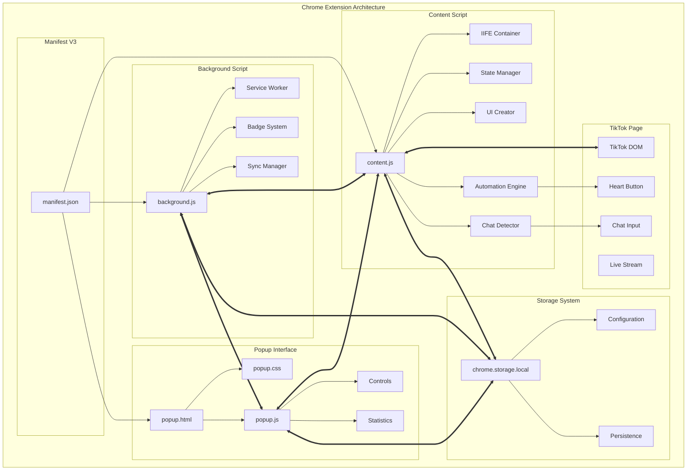
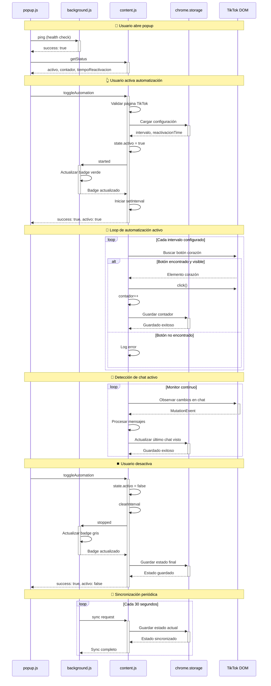
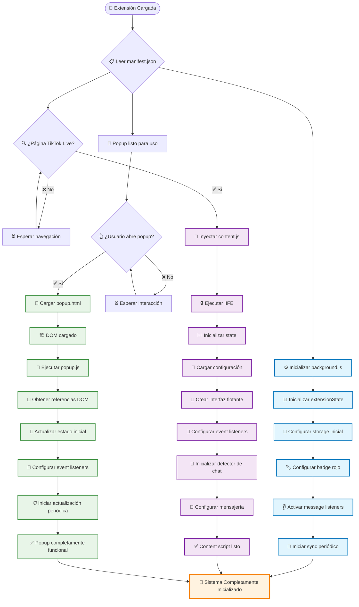
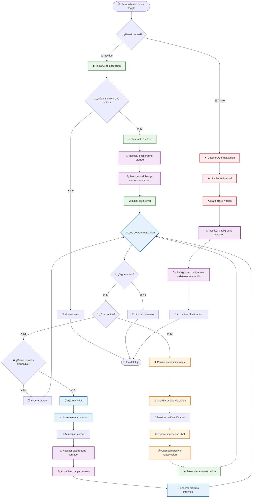
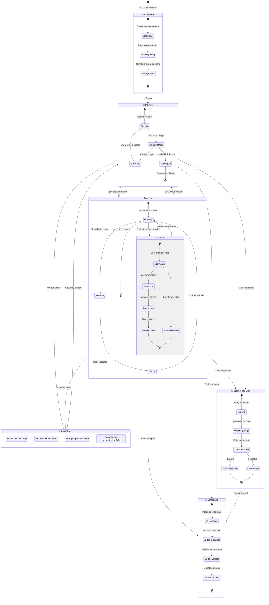
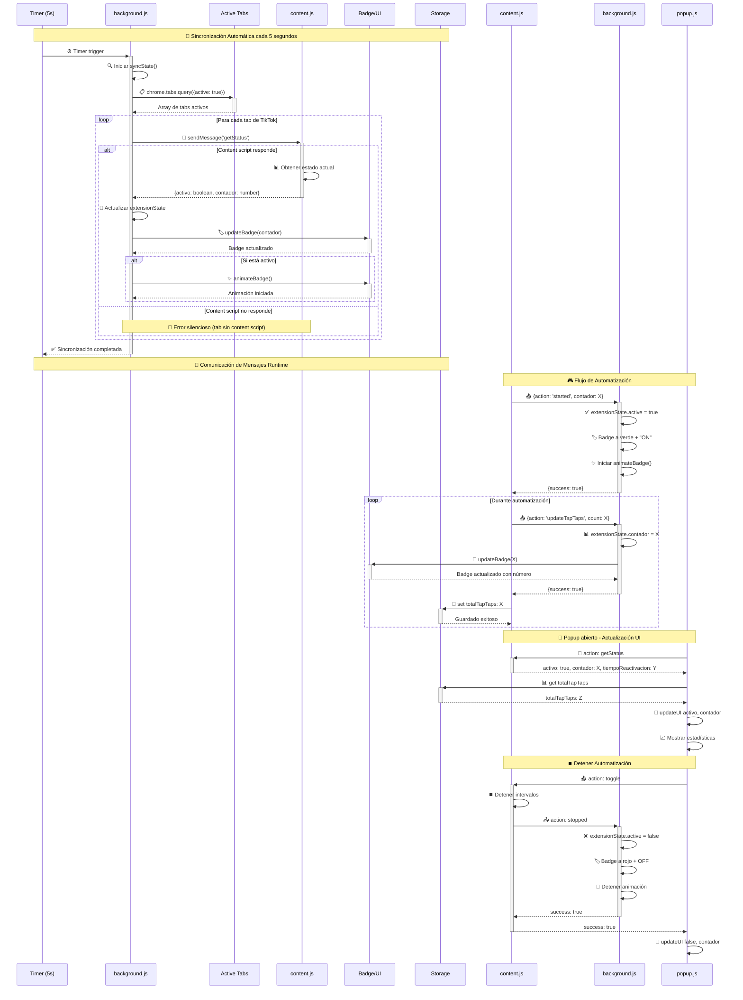

# 🏗️ DIAGRAMA COMPLETO DE ARQUITECTURA Y FLUJOS
## TikTok Auto Tap-Tap - Chrome Extension

**📅 Fecha de Actualización:** 7 de diciembre de 2024  
**👨‍💻 Desarrollador:** Emerick Echeverría Vargas  
**📊 Estado:** Arquitectura actualizada con sistema contextual

---

## 📋 **ÍNDICE DE DIAGRAMAS**

1. [🎯 Arquitectura General](#-arquitectura-general)
2. [🔄 Flujo de Comunicación entre Componentes](#-flujo-de-comunicación-entre-componentes)
3. [⚡ Proceso de Inicialización](#-proceso-de-inicialización)
4. [🎮 Flujo de Automatización Principal](#-flujo-de-automatización-principal)
5. [💬 Sistema de Detección de Chat](#-sistema-de-detección-de-chat)
6. [🎨 Gestión de UI y Estados](#-gestión-de-ui-y-estados)
7. [💾 Sistema de Almacenamiento](#-sistema-de-almacenamiento)
8. [🔄 Sincronización y Background](#-sincronización-y-background)

---

## 🎯 **ARQUITECTURA GENERAL**



---

## 🔄 **FLUJO DE COMUNICACIÓN ENTRE COMPONENTES**



---

## ⚡ **PROCESO DE INICIALIZACIÓN**



---

## 🎮 **FLUJO DE AUTOMATIZACIÓN PRINCIPAL**


```

---

## 💬 **SISTEMA DE DETECCIÓN DE CHAT**

```mermaid
flowchart TD
    CHAT_INIT([🚀 Inicializar Sistema de Chat]) --> IMMEDIATE_SEARCH[🔍 Búsqueda inmediata de chat]
    
    IMMEDIATE_SEARCH --> CHAT_FOUND{❓ ¿Chat encontrado?}
    
    CHAT_FOUND -->|✅ Sí| CONFIGURE_EVENTS[⚙️ Configurar eventos de chat]
    CHAT_FOUND -->|❌ No| START_OBSERVER[👁️ Iniciar MutationObserver]
    
    %% Observer path
    START_OBSERVER --> OBSERVE_DOM[🌐 Observar cambios en DOM]
    OBSERVE_DOM --> DOM_MUTATION{🔄 ¿Mutación detectada?}
    
    DOM_MUTATION -->|❌ No| OBSERVE_DOM
    DOM_MUTATION -->|✅ Sí| SEARCH_IN_MUTATION[🔍 Buscar chat en mutación]
    
    SEARCH_IN_MUTATION --> FOUND_IN_MUTATION{❓ ¿Chat encontrado?}
    FOUND_IN_MUTATION -->|❌ No| OBSERVE_DOM
    FOUND_IN_MUTATION -->|✅ Sí| CLEANUP_OBSERVER[🧹 Limpiar observer]
    
    CLEANUP_OBSERVER --> CONFIGURE_EVENTS
    
    %% Events configuration
    CONFIGURE_EVENTS --> ADD_FOCUS_LISTENER[👂 Agregar listener 'focus']
    ADD_FOCUS_LISTENER --> ADD_INPUT_LISTENER[👂 Agregar listener 'input']
    ADD_INPUT_LISTENER --> ADD_BLUR_LISTENER[👂 Agregar listener 'blur']
    ADD_BLUR_LISTENER --> CHAT_SYSTEM_READY[✅ Sistema de chat configurado]
    
    %% Chat interaction flows
    CHAT_SYSTEM_READY --> WAIT_INTERACTION[⏳ Esperar interacción]
    
    WAIT_INTERACTION --> USER_FOCUSES{👆 ¿Usuario enfoca chat?}
    USER_FOCUSES -->|❌ No| WAIT_INTERACTION
    USER_FOCUSES -->|✅ Sí| PAUSE_AUTOMATION[⏸️ Pausar automatización]
    
    PAUSE_AUTOMATION --> CLEAR_TIMER[🗑️ Limpiar timer previo]
    CLEAR_TIMER --> SHOW_CHAT_NOTIFICATION[🔔 Mostrar notificación 'Chat detectado']
    SHOW_CHAT_NOTIFICATION --> MONITOR_ACTIVITY[👁️ Monitorear actividad]
    
    MONITOR_ACTIVITY --> USER_TYPES{⌨️ ¿Usuario escribe?}
    USER_TYPES -->|✅ Sí| RESET_TIMER[🔄 Resetear timer inactividad]
    USER_TYPES -->|❌ No| CHECK_TIMER{⏱️ ¿Timer expirado?}
    
    RESET_TIMER --> MONITOR_ACTIVITY
    
    CHECK_TIMER -->|❌ No| MONITOR_ACTIVITY
    CHECK_TIMER -->|✅ Sí| START_COUNTDOWN[🕐 Iniciar cuenta regresiva]
    
    START_COUNTDOWN --> SHOW_COUNTDOWN[🔔 Mostrar "Reactivando en X segundos"]
    SHOW_COUNTDOWN --> COUNTDOWN_LOOP{🔄 Loop cuenta regresiva}
    
    COUNTDOWN_LOOP --> COUNTDOWN_TICK[⏰ Tick cuenta regresiva]
    COUNTDOWN_TICK --> UPDATE_NOTIFICATION[🔄 Actualizar notificación]
    UPDATE_NOTIFICATION --> COUNTDOWN_FINISHED{⏱️ ¿Cuenta terminada?}
    
    COUNTDOWN_FINISHED -->|❌ No| COUNTDOWN_LOOP
    COUNTDOWN_FINISHED -->|✅ Sí| REACTIVATE_AUTO[▶️ Reactivar automatización]
    
    REACTIVATE_AUTO --> SHOW_SUCCESS[🔔 Mostrar 'Reactivado automáticamente']
    SHOW_SUCCESS --> WAIT_INTERACTION
    
    %% User blur handling
    MONITOR_ACTIVITY --> USER_BLURS{👋 ¿Usuario sale del chat?}
    USER_BLURS -->|❌ No| MONITOR_ACTIVITY
    USER_BLURS -->|✅ Sí| IMMEDIATE_REACTIVATE[⚡ Reactivar inmediatamente]
    IMMEDIATE_REACTIVATE --> WAIT_INTERACTION
    
    %% Styling
    classDef observerStyle fill:#e1f5fe,stroke:#0277bd,stroke-width:2px
    classDef eventsStyle fill:#e8f5e8,stroke:#388e3c,stroke-width:2px
    classDef pauseStyle fill:#fff3e0,stroke:#f57c00,stroke-width:2px
    classDef countdownStyle fill:#f3e5f5,stroke:#7b1fa2,stroke-width:2px
    classDef reactivateStyle fill:#e8f5e8,stroke:#4caf50,stroke-width:2px
    
    class START_OBSERVER,OBSERVE_DOM,SEARCH_IN_MUTATION,CLEANUP_OBSERVER observerStyle
    class CONFIGURE_EVENTS,ADD_FOCUS_LISTENER,ADD_INPUT_LISTENER,ADD_BLUR_LISTENER eventsStyle
    class PAUSE_AUTOMATION,CLEAR_TIMER,MONITOR_ACTIVITY pauseStyle
    class START_COUNTDOWN,COUNTDOWN_LOOP,COUNTDOWN_TICK,UPDATE_NOTIFICATION countdownStyle
    class REACTIVATE_AUTO,IMMEDIATE_REACTIVATE,SHOW_SUCCESS reactivateStyle
```

---

## 🎨 **GESTIÓN DE UI Y ESTADOS**



---

## 💾 **SISTEMA DE ALMACENAMIENTO**

```mermaid
graph TB
    subgraph "Chrome Storage System"
        subgraph "Storage Keys"
            TOTAL[totalTapTaps<br/>📊 Contador global]
            TIEMPO[tiempoReactivacion<br/>⏰ Tiempo de reactivación]
            ACTIVO[estado_activo<br/>🔄 Estado persistente]
        end
        
        subgraph "Storage Operations"
            GET[chrome.storage.local.get()]
            SET[chrome.storage.local.set()]
            WATCH[storage.onChanged]
        end
    end
    
    subgraph "Content Script Storage"
        CS_SAVE[safeStorageOperation()]
        CS_LOAD[Cargar configuración]
        CS_AUTO[Auto-save on changes]
    end
    
    subgraph "Background Script Storage"
        BG_INIT[Inicialización storage]
        BG_SYNC[Sincronización automática]
        BG_PERSIST[Persistencia de estado]
    end
    
    subgraph "Popup Script Storage"
        POP_LOAD[Cargar estadísticas]
        POP_CONFIG[Configuración de usuario]
        POP_UPDATE[Actualización periódica]
    end
    
    %% Data flow
    CS_SAVE --> SET
    CS_LOAD --> GET
    BG_INIT --> SET
    BG_SYNC --> GET
    BG_PERSIST --> SET
    POP_LOAD --> GET
    POP_CONFIG --> SET
    POP_UPDATE --> GET
    
    SET --> TOTAL
    SET --> TIEMPO
    SET --> ACTIVO
    
    GET --> TOTAL
    GET --> TIEMPO
    GET --> ACTIVO
    
    %% Cross-component sync
    WATCH --> CS_AUTO
    WATCH --> BG_SYNC
    WATCH --> POP_UPDATE
    
    %% Storage flow sequence
    subgraph "Storage Operations Flow"
        START_OP([Operation Initiated])
        VALIDATE[Validate Data]
        EXECUTE[Execute Operation]
        ERROR_CHECK{Error?}
        SUCCESS[Success Response]
        ERROR_HANDLE[Error Handling]
        RETRY{Retry?}
        FALLBACK[Fallback/Default]
        
        START_OP --> VALIDATE
        VALIDATE --> EXECUTE
        EXECUTE --> ERROR_CHECK
        ERROR_CHECK -->|No| SUCCESS
        ERROR_CHECK -->|Yes| ERROR_HANDLE
        ERROR_HANDLE --> RETRY
        RETRY -->|Yes| EXECUTE
        RETRY -->|No| FALLBACK
    end
```
```

---

## 🔄 **SINCRONIZACIÓN Y BACKGROUND**



---

## 📊 **MÉTRICAS Y ESTADÍSTICAS DEL SISTEMA**

### 🔢 **Componentes Principales**
- **6 archivos** principales de código
- **4 sistemas** de comunicación inter-componentes  
- **3 interfaces** de usuario (content UI, popup, badge)
- **2 sistemas** de almacenamiento (chrome.storage + estado runtime)
- **1 service worker** para gestión de background

### ⚡ **Flujos de Datos**
- **12 tipos** de mensajes diferentes entre componentes
- **5 segundos** de intervalo de sincronización automática
- **3 niveles** de manejo de errores y recuperación
- **2 tipos** de persistencia (sesión + permanente)

### 🎯 **Puntos de Integración**
- **Chrome APIs**: `tabs`, `storage`, `runtime`, `action`
- **TikTok DOM**: Detección de elementos, eventos de chat
- **UI Components**: 3 interfaces sincronizadas en tiempo real
- **Background Tasks**: Sincronización, badges, persistencia

---

## 👨‍💻 **Información del Desarrollador**
- **Autor**: Emerick Echeverría Vargas (@EmerickVar)
- **Organización**: New Age Coding Organization
- **Proyecto**: TikTok Auto Tap-Tap Chrome Extension
- **Versión**: 1.0.0
- **Fecha de diagramas**: 7 de diciembre de 2024

---

> **📌 Nota**: Estos diagramas representan la arquitectura completa y todos los flujos de la extensión TikTok Auto Tap-Tap, proporcionando una visión comprehensiva del sistema para desarrolladores, colaboradores y futuras modificaciones del proyecto.
