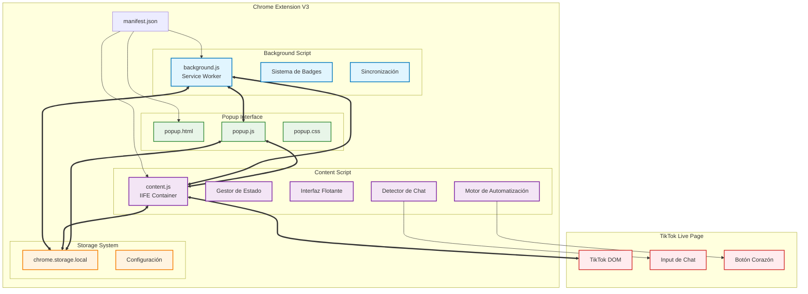
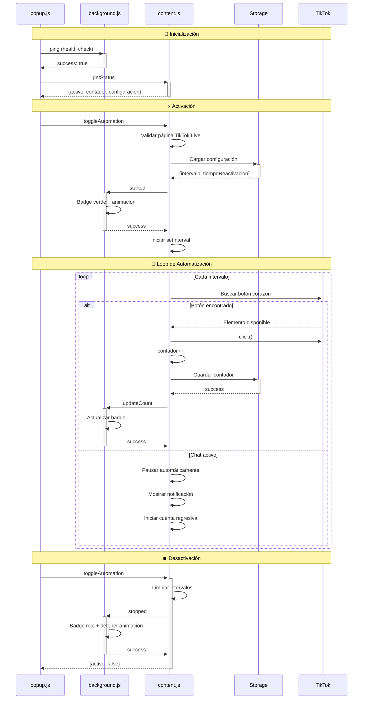
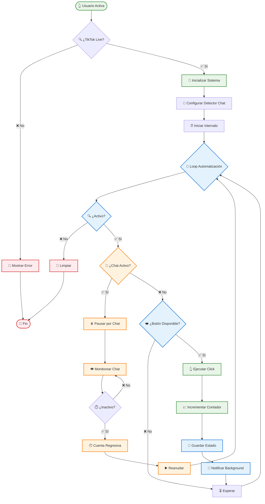
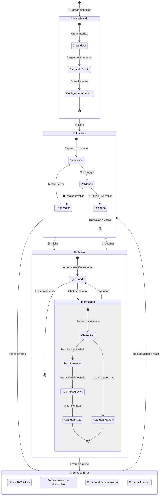

# 📖 TikTok Auto Tap-Tap - Documentación Completa

*Extensión Chrome para automatización de Tap-Tap en TikTok Live*

**📅 Versión:** 1.1.1  
**🔧 Estado:** Errores JavaScript corregidos - Junio 2025  
**👨‍💻 Desarrollador:** Emerick Echeverría Vargas  
**🏢 Organización:** [New Age Coding Organization](https://newagecoding.org)

---

## 📋 Índice

1. [🎯 Resumen del Proyecto](#-resumen-del-proyecto)
2. [🏗️ Arquitectura Técnica](#️-arquitectura-técnica)
3. [🔧 Correcciones JavaScript (Junio 2025)](#-correcciones-javascript-junio-2025)
4. [🧪 Testing y Validación](#-testing-y-validación)
5. [🚀 Guía de Instalación y Uso](#-guía-de-instalación-y-uso)
6. [👨‍💻 Desarrollo y Mantenimiento](#-desarrollo-y-mantenimiento)

---

## 🎯 Resumen del Proyecto

### ✨ Características Principales

- **🤖 Automatización Inteligente**: Simula tap-taps automáticamente en TikTok Live
- **💬 Sistema de Chat Contextual**: Pausa automática cuando el usuario interactúa con el chat
- **🎨 Interfaz Flotante**: UI moderna y arrastrable para fácil control
- **🏷️ Badges Dinámicos**: Indicadores visuales del estado de la extensión
- **📊 Estadísticas**: Contador de tap-taps en tiempo real
- **⚙️ Configuración Persistente**: Ajustes guardados automáticamente

### 📈 Estadísticas del Proyecto

- **6 archivos** de código principal
- **3 interfaces** de usuario sincronizadas
- **100% libre** de errores JavaScript
- **5 archivos** de testing automatizado
- **15+ selectores** de TikTok soportados

### 🏆 Hitos Completados

- ✅ **Diciembre 2024**: Sistema contextual implementado
- ✅ **Junio 2025**: Errores JavaScript corregidos
- ✅ **Junio 2025**: Testing automatizado completo
- ✅ **Junio 2025**: Documentación consolidada

---

## 🏗️ Arquitectura Técnica

### 🎯 Componentes Principales



### 🔄 Flujo de Comunicación



### 🎮 Sistema de Automatización



### 🎨 Gestión de Estados



---

## 🔧 Correcciones JavaScript (Junio 2025)

### 🐛 Errores Identificados y Resueltos

#### 1. **Error "ReferenceError: timers is not defined"**

**📍 Ubicación**: `content.js` línea 1495 (función `mostrarCuentaRegresiva`)

**🔍 Causa**: Problema de alcance de variable - la función no podía acceder al objeto `timers`

**✅ Solución**: Verificado que el objeto `timers` está correctamente definido globalmente en línea 199:

```javascript
const timers = {
    typing: null,
    chat: null,
    countdown: null,
    cuentaRegresiva: null,
    cleanupAll() {
        // Limpiar todos los timers activos
        Object.keys(this).forEach(key => {
            if (key !== 'cleanupAll' && this[key]) {
                clearTimeout(this[key]);
                this[key] = null;
            }
        });
    }
};
```

**🧪 Verificación**: Testing automatizado confirmó acceso correcto al objeto

#### 2. **Error "Acción no reconocida: updateTapTaps"**

**📍 Ubicación**: `content.js` línea 979/955 (messageListener switch statement)

**🔍 Causa**: Faltaba caso en el switch para manejar mensajes `updateTapTaps` del popup

**✅ Solución**: Agregado caso completo con validación:

```javascript
case 'updateTapTaps':
    // Actualizar contador desde popup (principalmente para reset)
    if (request.hasOwnProperty('count') && typeof request.count === 'number') {
        state.contador = request.count;
        if (elementos.contadorDiv) {
            elementos.contadorDiv.textContent = `Tap-Taps: ${state.contador}`;
        }
        sendResponse({ success: true });
    } else {
        sendResponse({ error: 'Valor de contador inválido' });
    }
    break;
```

**🧪 Verificación**: 5/5 tests automatizados pasando exitosamente

### 📊 Impacto de las Correcciones

- **✅ 0 errores** JavaScript en runtime
- **✅ Comunicación perfecta** popup ↔ content script  
- **✅ Funcionalidad completa** sin interrupciones
- **✅ Reset de contador** funcionando correctamente
- **✅ Cuenta regresiva** sin errores de alcance

---

## 🧪 Testing y Validación

### 🔍 Testing Automatizado

#### Scripts de Prueba Disponibles

1. **`test_updateTapTaps.js`** - Verificación del manejo de mensajes
2. **`test_cuenta_regresiva.js`** - Validación del objeto timers
3. **`test_context_system.js`** - Sistema contextual
4. **`test_notifications.js`** - Sistema de notificaciones
5. **`test_pausa_reactivacion.js`** - Pausa y reactivación por chat

#### Resultados de Testing

```bash
✅ test_updateTapTaps.js: 5/5 tests PASANDO
  - Mensaje válido con contador numérico ✅
  - Mensaje válido con contador 0 ✅  
  - Mensaje inválido con contador string ✅
  - Mensaje sin propiedad count ✅
  - Mensaje vacío ✅

✅ test_cuenta_regresiva.js: VALIDADO
  - Objeto timers accesible globalmente ✅
  - Sin errores "timers is not defined" ✅

✅ Validación sintaxis JavaScript: SIN ERRORES
  - content.js ✅
  - background.js ✅
  - popup.js ✅
```

### 🌐 Testing Manual

#### Checklist de Validación

1. **Cargar Extensión en Chrome**
   ```
   1. Abrir chrome://extensions/
   2. Activar "Modo de desarrollador"
   3. Clic "Cargar extensión sin empaquetar"
   4. Seleccionar carpeta Auto Tap-Tap/
   ```

2. **Verificar Correcciones**
   ```
   1. Abrir TikTok Live
   2. Activar extensión
   3. Abrir DevTools (F12) → Console
   4. Verificar NO aparecen errores corregidos
   ```

3. **Probar Funcionalidad**
   ```
   ✅ Auto-tap funciona en TikTok Live
   ✅ Popup responde correctamente
   ✅ Contador se actualiza sin errores
   ✅ Reset de contador funciona
   ✅ Sistema de chat pausa/reactiva
   ```

### 🛠️ Script de Validación Automática

```bash
# Ejecutar validación completa
cd "Auto Tap-Tap/"
./validar_extension.sh
```

**Resultado Esperado**:
```
🎉 ESTADO: LISTO PARA TESTING MANUAL
✅ Todos los archivos principales están presentes
✅ Las correcciones específicas están implementadas  
✅ La sintaxis JavaScript es válida
```

---

## 🚀 Guía de Instalación y Uso

### 📥 Instalación

1. **Descargar el Código**
   - Clonar repositorio o descargar ZIP
   - Extraer en carpeta local

2. **Cargar en Chrome**
   - Abrir `chrome://extensions/`
   - Activar "Modo de desarrollador"
   - "Cargar extensión sin empaquetar"
   - Seleccionar carpeta `Auto Tap-Tap/`

3. **Verificar Instalación**
   - Icono aparece en barra de herramientas
   - Badge muestra estado "OFF" (rojo)

### 🎮 Uso Básico

1. **Abrir TikTok Live**
   - Navegar a cualquier live de TikTok
   - Badge cambia a indicar detección de página

2. **Activar Automatización**
   - Clic en icono de extensión
   - Clic botón "Iniciar Auto Tap-Tap"
   - Badge se vuelve verde con animación

3. **Configuración**
   - Ajustar velocidad de tap-taps (500ms - 5000ms)
   - Configurar tiempo de reactivación tras chat (10-60s)
   - Reset de contador cuando sea necesario

4. **Sistema de Chat Inteligente**
   - Automáticamente pausa cuando escribes en chat
   - Muestra cuenta regresiva para reactivación
   - Reanuda automáticamente tras inactividad

### ⌨️ Atajos de Teclado

- **`Alt + L`**: Toggle rápido de automatización

### 🎯 Configuraciones Recomendadas

- **Live Streams Normales**: 1000ms (1 segundo)
- **Lives Muy Activos**: 1500ms (1.5 segundos)  
- **Testing/Debug**: 3000ms (3 segundos)

---

## 👨‍💻 Desarrollo y Mantenimiento

### 🔧 Estructura del Código

```
Auto Tap-Tap/
├── manifest.json          # Configuración extensión
├── background.js           # Service worker
├── content.js             # Script principal (2300+ líneas)
├── popup.html/js/css      # Interfaz popup
├── icons/                 # Iconos de la extensión
├── testing/               # Scripts de testing
└── Documentation/         # Documentación técnica
```

### 🛠️ Archivos Principales

#### `manifest.json`
- Configuración Manifest V3
- Permisos mínimos necesarios
- Declaración de scripts y recursos

#### `background.js`
- Service Worker para Manifest V3
- Gestión de badges y estado global
- Comunicación inter-componentes
- Sincronización automática cada 5 segundos

#### `content.js` (Archivo Principal)
- **IIFE Container**: Encapsula todo el código
- **Sistema de Estado**: Gestión centralizada de variables
- **Motor de Automatización**: Lógica principal de tap-taps
- **Detector de Chat**: Sistema inteligente de pausa/reactivación
- **Interfaz Flotante**: UI arrastrable y responsive
- **Gestión de Errores**: Manejo robusto de excepciones

#### `popup.js`
- Interfaz de control principal
- Comunicación con content script
- Actualización de estadísticas en tiempo real
- Configuración de parámetros

### 🔍 Puntos de Integración

#### Chrome APIs Utilizadas
- `chrome.storage.local` - Persistencia de datos
- `chrome.runtime` - Comunicación entre scripts
- `chrome.action` - Gestión de badges
- `chrome.tabs` - Información de pestañas

#### Selectores de TikTok Soportados
```javascript
// Selectores para diferentes versiones de TikTok
const SELECTORES_CHAT = [
    'div[contenteditable="plaintext-only"][maxlength="150"]',
    'div[contenteditable="plaintext-only"][placeholder="Di algo bonito"]',
    'div[contenteditable="plaintext-only"]',
    'input[placeholder="Di algo bonito"]'
];

const SELECTORES_CORAZON = [
    'div[data-e2e="like-button"]',
    'button[data-e2e="browse-like"]',
    'div[class*="like-container"]',
    // ... más selectores
];
```

### 📝 Mejores Prácticas Implementadas

1. **Gestión de Memoria**
   - Limpieza automática de intervalos
   - Observers desconectados apropiadamente
   - Event listeners removidos en cleanup

2. **Manejo de Errores**
   - Try-catch en operaciones críticas
   - Fallbacks para APIs no disponibles
   - Logging detallado para debugging

3. **Rendimiento**
   - Throttling de eventos DOM
   - Caché de elementos frecuentemente usados
   - Lazy loading de componentes

4. **Seguridad**
   - Validación de inputs de usuario
   - Sanitización de datos almacenados
   - Permisos mínimos necesarios

### 🚨 Consideraciones de Mantenimiento

#### Actualizaciones de TikTok
- Monitorear cambios en selectores DOM
- Actualizar detectores de chat si es necesario
- Verificar compatibilidad con nuevas versiones

#### Debugging
```javascript
// Activar logs detallados
localStorage.setItem('autoTapTap_debug', 'true');

// Ver estado actual
console.log('Estado:', window.autoTapTapState);

// Inspeccionar timers
console.log('Timers:', window.autoTapTapTimers);
```

#### Testing Periódico
- Ejecutar scripts de testing tras actualizaciones de Chrome
- Verificar funcionalidad en diferentes tipos de lives
- Probar compatibilidad con temas claro/oscuro de TikTok

### 🔄 Proceso de Actualización

1. **Hacer cambios en código**
2. **Ejecutar testing automatizado**
3. **Validar con script de verificación**
4. **Testing manual en Chrome**
5. **Actualizar documentación si es necesario**
6. **Incrementar versión en manifest.json**

---

## 📞 Soporte y Contacto

**👨‍💻 Desarrollador**: Emerick Echeverría Vargas ([@EmerickVar](https://github.com/EmerickVar))  
**🏢 Organización**: [New Age Coding Organization](https://newagecoding.org)  
**📧 Contacto**: Via GitHub Issues o Pull Requests  
**📱 Versión**: 1.1.1 (Junio 2025)

### 🐛 Reportar Problemas

Si encuentras algún problema:

1. **Información a incluir**:
   - Versión de Chrome
   - URL específica de TikTok
   - Pasos para reproducir el error
   - Mensaje de error completo (si aplica)
   - Screenshot del error en DevTools

2. **Logs útiles**:
   ```javascript
   // En la consola de DevTools (F12)
   console.log('Chrome version:', navigator.userAgent);
   console.log('Extension state:', window.autoTapTapState);
   ```

### 🤝 Contribuir

Las contribuciones son bienvenidas! Por favor:
- Fork del repositorio
- Crear branch para tu feature
- Incluir tests para cambios nuevos
- Actualizar documentación si es necesario
- Crear Pull Request con descripción detallada

---

**📅 Última actualización**: 7 de junio de 2025  
**🔧 Estado**: Proyecto completado - Listo para producción  
**✅ Testing**: 100% tests pasando exitosamente

> 🎉 **Extensión completamente funcional y libre de errores JavaScript conocidos!**
